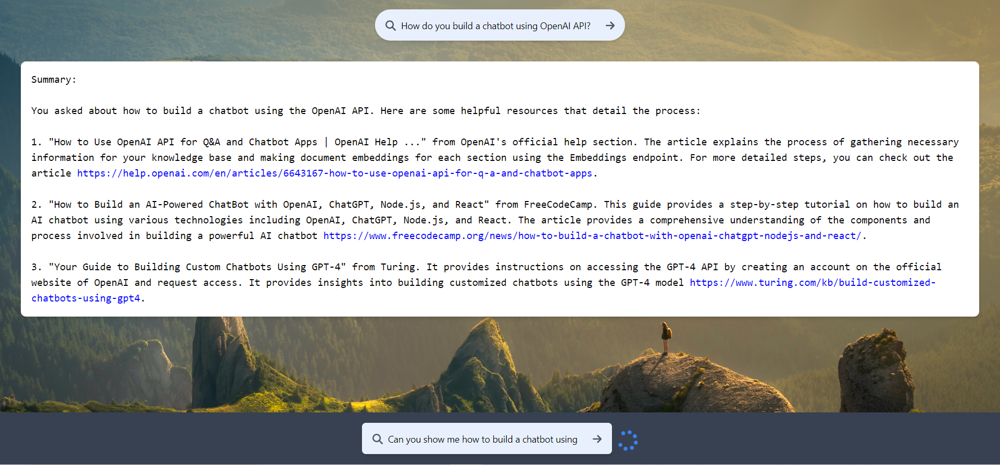
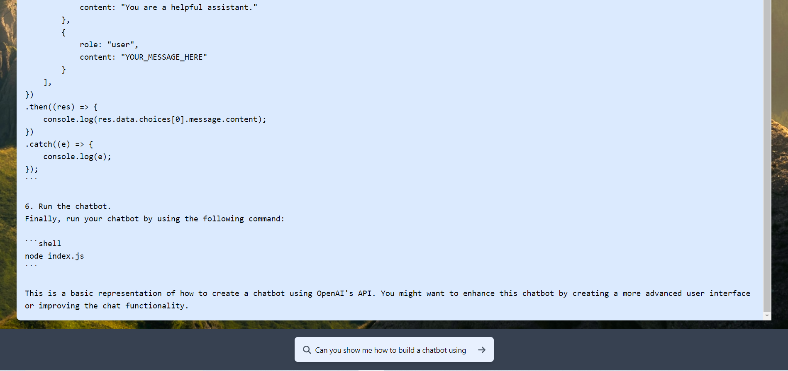

# Bing AI Clone

- A clone project of the Bing AI with Google Custom Search Engine and GPT-3.5/4.

> How does it work?

1. The user can first conduct a web search using the top search bar, which uses GPT-3.5 to summarize the search results for the user.
2. Then, the user can ask questions regarding the searched result by entering their prompt on the bottom search bar, which formats the searched results and the user's prompt together and sends it to GPT-4, which formulates an answer.

> Advantages of This Workflow

1. By conducting a search before asking GPT-4, GPT-4 can access data that was not part of its training corpus, which allows GPT-4 to answer questions that involve recent data without being bound by the training date cutoff.
2. Furthermore, my project limits to number of web sources to three and the token count to 4k before passing it into GPT-4, with clear instructions that inform the LLM of the line between the prompt and contextual data (the web sources). As a result, my project often leads to higher quality answers from GPT-4 compared to Bing AI.

> Web-Search Example

 

> Chatbot Prompt Example

